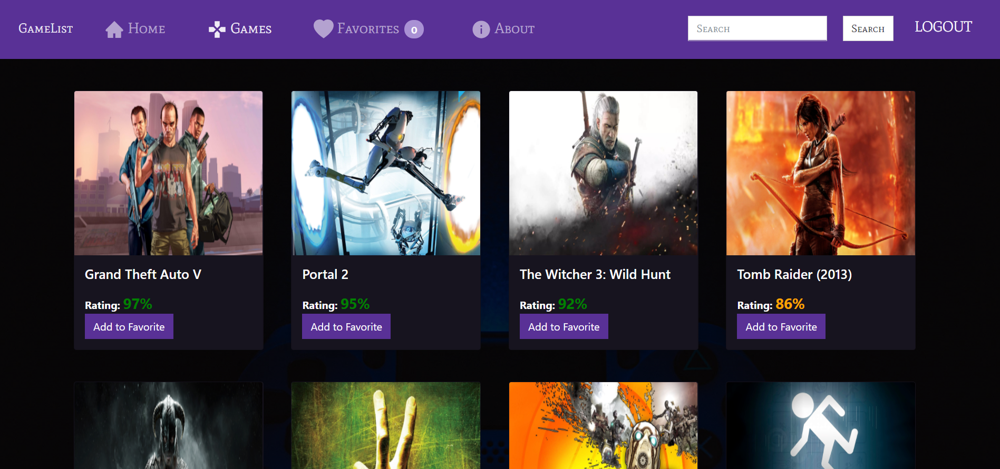

# GameReview (Functional)

### PROJECT3: 
Built using
- React JS (Functional Components)
- Bootsrap
- Axios

## DEMO PICTURE:

## DEMO Gif Showcase:

## DEMO Gif Search:

 
<b> Student:</b>  Mohammed Rashed Albalawi.
 
<b> Group:</b>  Al-qiddiyah.
 
<b> Group Supervisor:</b>  Noorah Abdullah.

 

 

 

  
# مشروع الأسبوع الثالث | Project 03 
## الوصف
في هذا المشروع، سيتم تحويل المشروع السابق التابع للأسبوع الثاني إلى function component مع تطبيق المتطلبات أدناه
## المتطلبات
- استخدام مكتبة react-router-dom 
- استخدام Third-Party-Authentication 
- استخدام دالتين على الأقل من دوال Hooks

### ملاحظة
يجب إرفاق صورة من المشروع في ملف README.md
  

