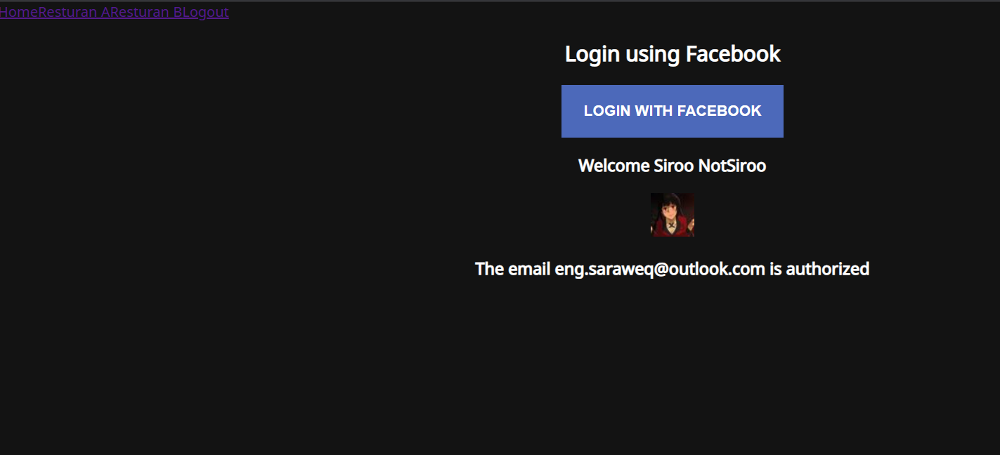
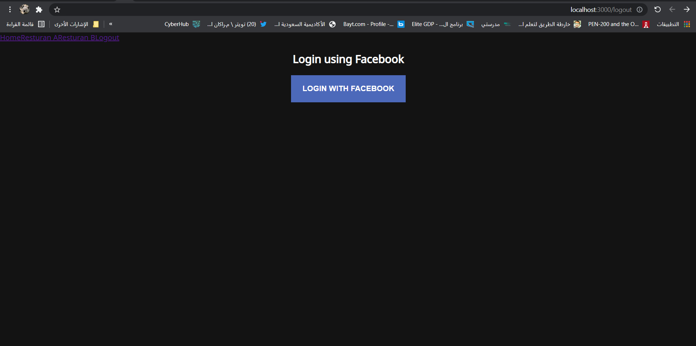

 

  
# مشروع الأسبوع الثالث | Project 03 
## الوصف
في هذا المشروع، سيتم تحويل المشروع السابق التابع للأسبوع الثاني إلى function component مع تطبيق المتطلبات أدناه
## المتطلبات
- استخدام مكتبة react-router-dom 
- استخدام Third-Party-Authentication 
- استخدام دالتين على الأقل من دوال Hooks

 
 
 

  

