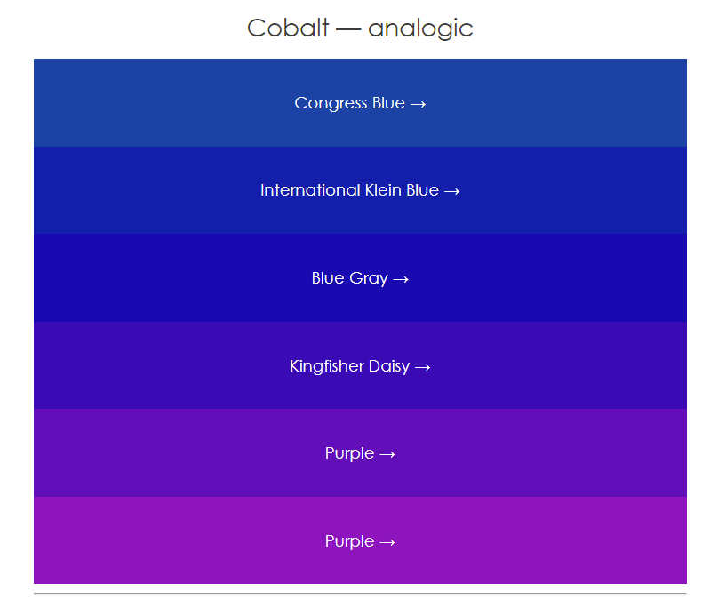

  
 # Project Description: 
  
   
 A random wheel picker that allows the user to randomaly pick an item from a list provided by the user. 
 The user first must enter the items of the list one by one then clicks the SPIN button to start spinning the wheel.  

 Fir authentication, Facebook authentication was used. Once the user is authenticated, the information are stored in the local storage so the user is remembered later. 

 

When the user enters a single item, the wheel will not appear. There must 2 items to choose among at least. 

# API used in this project:

<a href="https://www.thecolorapi.com/" >The Color API</a> was used in the project, which is a simple API that provides many services. Given a color, the API converts the color to different systems ex. hex, rgb etc. Moreover, it provides different schemes for a single color.   
  

When the user enters a list of items and clicks SPIN, a random hex color value will be generated and sent as a request parameter in the URL to the API besides the number of items in the list and the desired color scheme. The API will provide a scheme for the choosen color where the number of colors equal the number of items. 

The colors of the retrieved scheme will be used to color the sectors of the spinning wheel. 